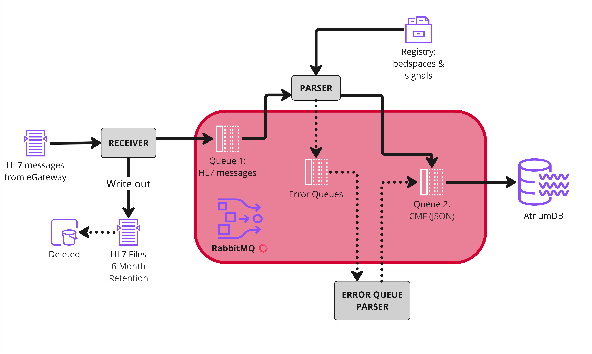

# Overview

!!! warning
    This code is a work in progress; we are sharing it to help others set up similar pipelines to us, but you should do your own testing before relying on it for any workflows. We welcome suggestions for any improvements or fixes; please open an issue or a pull request!

These are the docs for the ICU-Heart Mindray Waveform Adapter, developed by the [ICU-Heart Team](https://icu-heart.github.io/) at the University of Edinburgh in parternship with NHS Lothian and DataLoch. 

The job of the adapter is to receive the HL7 messages sent out by the Mindray eGateway and convert them to a common message format (CMF), which can then be inputted to AtriumDB. If the adapter fails, data streaming from the eGateway will be irretrievably lost, and so it is designed to be robust. To do this, incoming HL7s are written immediately to disk, and communication between modules is mediated by [RabbitMQ](https://www.rabbitmq.com/), a message queuing system. This prevents bottlenecks from overwhelming the eGateway, which would result in lost messages. 

## Architecture

1. HL7 messages are picked up by the [Receiver](receiver.md) module, which pushes them to a RabbitMQ queue called "hl7". The [Receiver](receiver.md) module also writes a copy to disk. These backup files are retained for a period of months in case of pipeline failures. 
2. Messages from the "hl7" queue are pulled by the [Parser](parser.md) module, which parses the HL7 files to extract the required information, and outputs this as CMF messages which are pushed to a "cmf_exchange" [exchange](https://www.rabbitmq.com/docs/exchanges). If this process fails, the original messages are pushed to a series of error queues. The [Parser](parser.md) relies on a registry of known bedspaces and signals so that it can detect and deal with unexpected information. 
3. Messages can also be parsed by pulling from the error queues, once known issues have been fixed.

## Metrics monitoring system

The adapter is monitored using a [metrics monitoring system](metrics.md), which allows us to check everything is running as expected, and identify any errors which might occur. In the system diagrams, pink circles indicate components with monitored metrics. These components are sending metrics over [Open Telemetry](https://opentelemetry.io/docs/) which can be picked up by [Prometheus](https://prometheus.io/). Prometheus can also be configured to scrape metrics at regular intervals from RabbitMQ. These metrics can then be are pulled by [Grafana](https://grafana.com/) for visualisation and monitoring

## Container setup

We recommend to run the adapter via a series of containers (e.g. docker/podman) on a shared network, and provide some materials for configuring these. We are using the following:

| Container | Base | Core pipeline | Purpose |
| --------- | ------- | ---------- | ------- |
| python-hl7_receiver | python | ✓ | [Receiving messages](receiver.md) from eGateway |
| python-hl7_parser | python | ✓ | [Parsing realtime](parser.md#realtime-parser) messages and publishing to CMF exchange | 
| python-hl7_error_parser | python | ✗ | Parsing [failed messages](parser.md#error-parser) from error queues |
| rabbitmq | rabbitmq | ✓ | Managing flow of messages via [RabbitMQ](rabbitmq.md) |
| prometheus | prometheus | ✓ | Collating metrics using [Prometheus](metrics.md) |
| grafana | grafana | ✓ | Visualising metrics via [Grafana](metrics.md) dashboards. |

